# GMDM Profile Class Diagrams - Mermaid Format

This document contains all the PlantUML class diagrams from the GMDM profiles converted to Mermaid format.

Note that this document was auto-generated using AI and may contain errors. Refer back to the original .puml or .svg diagrams in the individual profiles for an authorative version.

## 1. Asset Profile

**Profile:** Asset  
**Namespace:** http://www.ucaiug.org/gmdm/asset#

## 2. DiagramLayout Profile

**Profile:** DiagramLayout  
**Namespace:** http://www.ucaiug.org/gmdm/diagram_layout#

## 3. GeographicalLocation Profile

**Profile:** GeographicalLocation  
**Namespace:** http://www.ucaiug.org/gmdm/geographical_location#

## 4. MarketNode Profile

**Profile:** Profile  
**Namespace:** http://www.ucaiug.org/gmdm/market/node#

## 5. UnbalancedConnectivity Profile

**Profile:** UnbalancedConnectivity  
**Namespace:** http://www.ucaiug.org/gmdm/connectivity/unbalanced#

```mermaid
classDiagram
    class Identity {
        <<abstract>>
        +identifier: string
    }
    
    class IdentifiedObject {
        <<abstract>>
        +description: string [0..1]
        +name: string [0..1]
    }
    
    class PowerSystemResource {
        <<abstract>>
    }
    
    class Equipment {
        <<abstract>>
        +aggregate: boolean [0..1]
        +normallyInService: boolean [0..1]
    }
    
    class ConductingEquipment {
        <<abstract>>
    }
    
    class EnergyConnection {
        <<abstract>>
    }
    
    class RegulatingCondEq {
        <<abstract>>
    }
    
    class RotatingMachine {
        <<abstract>>
    }
    
    class Conductor {
        <<abstract>>
    }
    
    class Connector {
        <<abstract>>
    }
    
    class Switch {
        <<abstract>>
        +locked: boolean [0..1]
        +normalOpen: boolean
    }
    
    class ProtectedSwitch {
        <<abstract>>
    }
    
    class ShuntCompensator {
        <<abstract>>
        +grounded: boolean [0..1]
        +phaseConnection: PhaseShuntConnectionKind [0..1]
    }
    
    class ShuntCompensatorPhase {
        <<abstract>>
        +phase: SinglePhaseKind
    }
    
    class ConnectivityNodeContainer {
        <<abstract>>
    }
    
    class EquipmentContainer {
        <<abstract>>
    }
    
    class TransformerEnd {
        <<abstract>>
        +endNumber: integer
    }
    
    class ACDCTerminal {
        <<abstract>>
        +sequenceNumber: integer [0..1]
    }
    
    class ACLineSegment {
    }
    
    class ACLineSegmentPhase {
        +phase: SinglePhaseKind
    }
    
    class AsynchronousMachine {
    }
    
    class SynchronousMachine {
    }
    
    class BaseVoltage {
        +nominalVoltage: Voltage
    }
    
    class Breaker {
    }
    
    class BusbarSection {
    }
    
    class ConnectivityNode {
    }
    
    class Disconnector {
    }
    
    class EnergyConsumer {
        +customerCount: integer [0..1]
        +grounded: boolean [0..1]
        +phaseConnection: PhaseShuntConnectionKind
    }
    
    class EnergyConsumerPhase {
        +phase: SinglePhaseKind
    }
    
    class EnergySource {
    }
    
    class Feeder {
    }
    
    class Fuse {
    }
    
    class Line {
    }
    
    class LinearShuntCompensator {
    }
    
    class LinearShuntCompensatorPhase {
    }
    
    class LoadBreakSwitch {
    }
    
    class PowerElectronicsConnection {
    }
    
    class PowerElectronicsConnectionPhase {
        +phase: SinglePhaseKind
    }
    
    class PowerTransformer {
        +vectorGroup: string
    }
    
    class PowerTransformerEnd {
        +connectionKind: WindingConnection [0..1]
    }
    
    class Recloser {
    }
    
    class Sectionaliser {
    }
    
    class SeriesCompensator {
    }
    
    class Substation {
    }
    
    class SwitchPhase {
        +normalOpen: boolean [0..1]
        +phaseSide1: SinglePhaseKind
        +phaseSide2: SinglePhaseKind
    }
    
    class Terminal {
    }
    
    class TransformerTank {
    }
    
    class TransformerTankEnd {
        +orderedPhases: OrderedPhaseCodeKind [0..1]
    }
    
    class VoltageLevel {
    }
    
    class OrderedPhaseCodeKind {
        <<enumeration>>
        A
        AB
        ABC
        ABCN
        ABN
        AC
        ACB
        ACBN
        ACN
        AN
        B
        BA
        BAC
        BACN
        BAN
        BC
        BCA
        BCAN
        BCN
        BN
        ... [33 more literals]
    }
    
    class PhaseShuntConnectionKind {
        <<enumeration>>
        D
        G
        I
        Y
        Yn
    }
    
    class SinglePhaseKind {
        <<enumeration>>
        A
        B
        C
        N
        s1
        s2
    }
    
    class WindingConnection {
        <<enumeration>>
        A
        D
        I
        Y
        Yn
        Z
        Zn
    }
    
    Identity <|-- IdentifiedObject
    IdentifiedObject <|-- PowerSystemResource
    IdentifiedObject <|-- BaseVoltage
    IdentifiedObject <|-- ConnectivityNode
    IdentifiedObject <|-- ACDCTerminal
    IdentifiedObject <|-- TransformerEnd
    PowerSystemResource <|-- Equipment
    PowerSystemResource <|-- ConnectivityNodeContainer
    PowerSystemResource <|-- ACLineSegmentPhase
    PowerSystemResource <|-- EnergyConsumerPhase
    PowerSystemResource <|-- PowerElectronicsConnectionPhase
    PowerSystemResource <|-- ShuntCompensatorPhase
    PowerSystemResource <|-- SwitchPhase
    Equipment <|-- ConductingEquipment
    ConductingEquipment <|-- EnergyConnection
    ConductingEquipment <|-- Conductor
    ConductingEquipment <|-- Connector
    ConductingEquipment <|-- Switch
    ConductingEquipment <|-- PowerTransformer
    ConductingEquipment <|-- SeriesCompensator
    EnergyConnection <|-- RegulatingCondEq
    EnergyConnection <|-- EnergyConsumer
    EnergyConnection <|-- EnergySource
    RegulatingCondEq <|-- RotatingMachine
    RegulatingCondEq <|-- PowerElectronicsConnection
    RegulatingCondEq <|-- ShuntCompensator
    RotatingMachine <|-- AsynchronousMachine
    RotatingMachine <|-- SynchronousMachine
    Conductor <|-- ACLineSegment
    Connector <|-- BusbarSection
    Switch <|-- ProtectedSwitch
    Switch <|-- Disconnector
    Switch <|-- Fuse
    Switch <|-- Sectionaliser
    ProtectedSwitch <|-- Breaker
    ProtectedSwitch <|-- LoadBreakSwitch
    ProtectedSwitch <|-- Recloser
    ShuntCompensator <|-- LinearShuntCompensator
    ShuntCompensatorPhase <|-- LinearShuntCompensatorPhase
    ConnectivityNodeContainer <|-- EquipmentContainer
    EquipmentContainer <|-- Feeder
    EquipmentContainer <|-- Line
    EquipmentContainer <|-- Substation
    EquipmentContainer <|-- VoltageLevel
    TransformerEnd <|-- PowerTransformerEnd
    TransformerEnd <|-- TransformerTankEnd
    ACDCTerminal <|-- Terminal
    Equipment <|-- TransformerTank
    
    ConductingEquipment --> BaseVoltage : "1"
    Equipment --> EquipmentContainer : "1"
    Equipment --> EquipmentContainer : "AdditionalEquipmentContainer 0..*"
    ACLineSegmentPhase --> ACLineSegment : "0..1"
    EnergyConsumerPhase --> EnergyConsumer : "1"
    PowerElectronicsConnectionPhase --> PowerElectronicsConnection : "1"
    ShuntCompensatorPhase --> ShuntCompensator : "1"
    SwitchPhase --> Switch : "1"
    PowerTransformerEnd --> PowerTransformer : "1"
    TransformerTankEnd --> TransformerTank : "1"
    TransformerTank --> PowerTransformer : "1"
    Terminal --> ConductingEquipment : "0..1"
    Terminal --> ConnectivityNode : "0..1"
    Terminal --> Feeder : "NormalHeadFeeder 0..1"
    Terminal --> TransformerEnd : "0..1"
    TransformerEnd --> BaseVoltage : "1"
    Feeder --> Substation : "NormalEnergizingSubstation 1"
    VoltageLevel --> BaseVoltage : "1"
    VoltageLevel --> Substation : "1"
```

## 6. UnbalancedElectrical Profile

**Profile:** UnbalancedElectrical  
**Namespace:** http://www.ucaiug.org/gmdm/electrical/unbalanced#

```mermaid
classDiagram
    class Identity {
        <<abstract>>
        +identifier: string
    }
    
    class IdentifiedObject {
        <<abstract>>
        +description: string [0..1]
        +name: string [0..1]
    }
    
    class PowerSystemResource {
        <<abstract>>
    }
    
    class Equipment {
        <<abstract>>
    }
    
    class ConductingEquipment {
        <<abstract>>
    }
    
    class EnergyConnection {
        <<abstract>>
    }
    
    class RegulatingCondEq {
        <<abstract>>
    }
    
    class RotatingMachine {
        <<abstract>>
        +ratedS: ApparentPower
        +ratedU: Voltage
    }
    
    class Conductor {
        <<abstract>>
        +length: Length
    }
    
    class Switch {
        <<abstract>>
        +ratedCurrent: CurrentFlow
    }
    
    class ProtectedSwitch {
        <<abstract>>
        +breakingCapacity: CurrentFlow [0..1]
    }
    
    class ShuntCompensator {
        <<abstract>>
        +aVRDelay: Seconds [0..1]
        +maximumSections: integer
        +nomU: Voltage
        +normalSections: integer
    }
    
    class ShuntCompensatorPhase {
        <<abstract>>
        +maximumSections: integer
        +normalSections: integer
    }
    
    class GeneratingUnit {
        <<abstract>>
        +ratedGrossMaxP: ActivePower [0..1]
    }
    
    class PowerElectronicsUnit {
        <<abstract>>
        +maxP: ActivePower
        +minP: ActivePower
    }
    
    class PowerElectronicsConnection {
        <<abstract>>
        +controlMode: ConverterControlModeKind [0..1]
        +maxQ: ReactivePower [0..1]
        +minQ: ReactivePower [0..1]
        +ratedS: ApparentPower
        +ratedU: Voltage
    }
    
    class ConnectivityNodeContainer {
        <<abstract>>
    }
    
    class ACDCTerminal {
        <<abstract>>
    }
    
    class TransformerEnd {
        <<abstract>>
        +grounded: boolean
        +rground: Resistance [0..1]
        +xground: Reactance [0..1]
    }
    
    class PerLengthLineParameter {
        <<abstract>>
    }
    
    class PerLengthImpedance {
        <<abstract>>
    }
    
    class TapChanger {
        <<abstract>>
        +controlEnabled: boolean
        +ctRatio: float [0..1]
        +highStep: integer
        +initialDelay: Seconds [0..1]
        +lowStep: integer
        +ltcFlag: boolean
        +neutralStep: integer
        +neutralU: Voltage
        +ptRatio: float [0..1]
        +subsequentDelay: Seconds [0..1]
    }
    
    class RegulatingControl {
        <<abstract>>
        +discrete: boolean
        +enabled: boolean
        +mode: RegulatingControlModeKind [0..1]
        +monitoredPhase: PhaseCode [0..1]
        +targetDeadband: float [0..1]
        +targetValue: float [0..1]
    }
    
    class ACLineSegment {
        <<Description>>
    }
    
    class ACLineSegmentPhase {
        <<Description>>
        +sequenceNumber: integer
    }
    
    class AsynchronousMachine {
        <<Description>>
    }
    
    class SynchronousMachine {
        <<Description>>
    }
    
    class BatteryUnit {
        +ratedE: RealEnergy [0..1]
    }
    
    class PhotoVoltaicUnit {
    }
    
    class PowerElectronicsWindUnit {
    }
    
    class PowerElectronicsThermalUnit {
    }
    
    class Breaker {
        <<Description>>
    }
    
    class Disconnector {
        <<Description>>
    }
    
    class EnergyConsumer {
        <<Description>>
    }
    
    class EnergySource {
        <<Description>>
        +nominalVoltage: Voltage
        +r: Resistance
        +x: Reactance
    }
    
    class FossilFuel {
        +fossilFuelType: FuelType
    }
    
    class Fuse {
        <<Description>>
    }
    
    class LinearShuntCompensator {
        <<Description>>
        +bPerSection: Susceptance
        +gPerSection: Conductance
    }
    
    class LinearShuntCompensatorPhase {
        <<Description>>
        +bPerSection: Susceptance
        +gPerSection: Conductance
    }
    
    class LoadBreakSwitch {
        <<Description>>
    }
    
    class LoadResponseCharacteristic {
        +exponentModel: boolean [0..1]
        +pConstantCurrent: float [0..1]
        +pConstantImpedance: float [0..1]
        +pConstantPower: float [0..1]
        +pFrequencyExponent: float [0..1]
        +pVoltageExponent: float [0..1]
        +qConstantCurrent: float [0..1]
        +qConstantImpedance: float [0..1]
        +qConstantPower: float [0..1]
        +qFrequencyExponent: float [0..1]
        +qVoltageExponent: float [0..1]
    }
    
    class PerLengthPhaseImpedance {
        +conductorCount: integer
    }
    
    class PhaseImpedanceData {
        +b: SusceptancePerLength
        +column: integer
        +r: ResistancePerLength
        +row: integer
        +x: ReactancePerLength
    }
    
    class PowerTransformer {
        <<Description>>
    }
    
    class PowerTransformerEnd {
        <<Description>>
        +b: Susceptance [0..1]
        +g: Conductance [0..1]
        +phaseAngleClock: integer [0..1]
        +r: Resistance
        +ratedS: ApparentPower
        +ratedU: Voltage
        +x: Reactance [0..1]
    }
    
    class RatioTapChanger {
        +stepVoltageIncrement: PerCent [0..1]
    }
    
    class Recloser {
        <<Description>>
    }
    
    class Sectionaliser {
        <<Description>>
    }
    
    class SeriesCompensator {
        <<Description>>
    }
    
    class TapChangerControl {
        +lineDropCompensation: boolean
        +lineDropR: Resistance [0..1]
        +lineDropX: Reactance [0..1]
        +maxLimitVoltage: Voltage
        +minLimitVoltage: Voltage
        +reverseLineDropR: Resistance [0..1]
        +reverseLineDropX: Reactance [0..1]
        +reverseTargetDeadband: Voltage [0..1]
        +reverseTargetValue: Voltage [0..1]
        +reverseToNeutral: boolean [0..1]
        +reversible: boolean
        +reversingDelay: Seconds [0..1]
        +reversingPowerThreshold: ApparentPower [0..1]
    }
    
    class Terminal {
        <<Description>>
    }
    
    class ThermalGeneratingUnit {
    }
    
    class TransformerCoreAdmittance {
        +b: Susceptance
        +g: Conductance
    }
    
    class TransformerMeshImpedance {
        +r: Resistance
        +x: Reactance
    }
    
    class TransformerTankEnd {
        <<Description>>
    }
    
    class WindGeneratingUnit {
        +windGenUnitType: WindGenUnitKind [0..1]
    }
    
    class ConverterControlModeKind {
        <<enumeration>>
        constantPowerFactor
        constantReactivePower
        dynamic
    }
    
    class FuelType {
        <<enumeration>>
        brownCoalLignite
        coal
        coalDerivedGas
        gas
        hardCoal
        lignite
        oil
        oilShale
        other
        peat
    }
    
    class PhaseCode {
        <<enumeration>>
        A
        AB
        ABC
        ABCN
        ABN
        AC
        ACN
        AN
        B
        BC
        BCN
        BN
        C
        CN
        N
        X
        XN
        XY
        XYN
        none
        ... [11 more literals]
    }
    
    class RegulatingControlModeKind {
        <<enumeration>>
        activePower
        admittance
        currentFlow
        powerFactor
        reactivePower
        temperature
        timeScheduled
        voltage
    }
    
    class WindGenUnitKind {
        <<enumeration>>
        offshore
        onshore
    }
    
    Identity <|-- IdentifiedObject
    Identity <|-- PhaseImpedanceData
    IdentifiedObject <|-- PowerSystemResource
    IdentifiedObject <|-- FossilFuel
    IdentifiedObject <|-- LoadResponseCharacteristic
    IdentifiedObject <|-- PerLengthLineParameter
    IdentifiedObject <|-- TransformerCoreAdmittance
    IdentifiedObject <|-- TransformerMeshImpedance
    IdentifiedObject <|-- ACDCTerminal
    IdentifiedObject <|-- TransformerEnd
    PowerSystemResource <|-- Equipment
    PowerSystemResource <|-- ConnectivityNodeContainer
    PowerSystemResource <|-- ACLineSegmentPhase
    PowerSystemResource <|-- ShuntCompensatorPhase
    PowerSystemResource <|-- RegulatingControl
    PowerSystemResource <|-- TapChanger
    Equipment <|-- ConductingEquipment
    Equipment <|-- GeneratingUnit
    Equipment <|-- PowerElectronicsUnit
    ConductingEquipment <|-- EnergyConnection
    ConductingEquipment <|-- Conductor
    ConductingEquipment <|-- Switch
    ConductingEquipment <|-- PowerTransformer
    ConductingEquipment <|-- SeriesCompensator
    EnergyConnection <|-- RegulatingCondEq
    EnergyConnection <|-- EnergyConsumer
    EnergyConnection <|-- EnergySource
    RegulatingCondEq <|-- RotatingMachine
    RegulatingCondEq <|-- PowerElectronicsConnection
    RegulatingCondEq <|-- ShuntCompensator
    RotatingMachine <|-- AsynchronousMachine
    RotatingMachine <|-- SynchronousMachine
    Conductor <|-- ACLineSegment
    Switch <|-- ProtectedSwitch
    Switch <|-- Disconnector
    Switch <|-- Fuse
    Switch <|-- Sectionaliser
    ProtectedSwitch <|-- Breaker
    ProtectedSwitch <|-- LoadBreakSwitch
    ProtectedSwitch <|-- Recloser
    ShuntCompensator <|-- LinearShuntCompensator
    ShuntCompensatorPhase <|-- LinearShuntCompensatorPhase
    GeneratingUnit <|-- ThermalGeneratingUnit
    GeneratingUnit <|-- WindGeneratingUnit
    PowerElectronicsUnit <|-- BatteryUnit
    PowerElectronicsUnit <|-- PhotoVoltaicUnit
    PowerElectronicsUnit <|-- PowerElectronicsWindUnit
    PowerElectronicsUnit <|-- PowerElectronicsThermalUnit
    PerLengthLineParameter <|-- PerLengthImpedance
    PerLengthImpedance <|-- PerLengthPhaseImpedance
    TapChanger <|-- RatioTapChanger
    RegulatingControl <|-- TapChangerControl
    TransformerEnd <|-- PowerTransformerEnd
    TransformerEnd <|-- TransformerTankEnd
    ACDCTerminal <|-- Terminal
    
    ACLineSegment --> PerLengthImpedance : "0..1"
    EnergyConsumer --> LoadResponseCharacteristic : "0..1"
    GeneratingUnit --> RotatingMachine : "1"
    PowerElectronicsUnit --> PowerElectronicsConnection : "0..1"
    PowerElectronicsThermalUnit --> FossilFuel : "0..1"
    ThermalGeneratingUnit --> FossilFuel : "0..*"
    PhaseImpedanceData --> PerLengthPhaseImpedance : "1"
    RatioTapChanger --> TransformerEnd : "1"
    RegulatingCondEq --> RegulatingControl : "0..1"
    RegulatingControl --> Terminal : "1"
    TapChanger --> TapChangerControl : "1"
    TransformerEnd --> TransformerCoreAdmittance : "0..1"
    TransformerMeshImpedance --> TransformerEnd : "FromTransformerEnd 0..1"
    TransformerMeshImpedance --> TransformerEnd : "ToTransformerEnd 0..*"
```

## 7. UsagePoint Profile

**Profile:** Profile  
**Namespace:** http://www.ucaiug.org/gmdm/usagepoint#

---

## Summary

This document contains the complete conversion of all 7 PlantUML class diagrams from the GMDM profiles to Mermaid format:

1. **Asset Profile** - Contains transformer asset information, tests, and related enumerations
2. **DiagramLayout Profile** - Defines diagram layout and visualization elements
3. **GeographicalLocation Profile** - Handles location and positioning of power system resources
4. **MarketNode Profile** - Simple profile for market node connectivity
5. **UnbalancedConnectivity Profile** - Complex connectivity model for unbalanced power systems
6. **UnbalancedElectrical Profile** - Comprehensive electrical characteristics for unbalanced systems
7. **UsagePoint Profile** - Simple usage point definition with phase information

Each diagram preserves the original class hierarchies, attributes, relationships, and enumerations from the PlantUML source files while using Mermaid's class diagram syntax.
